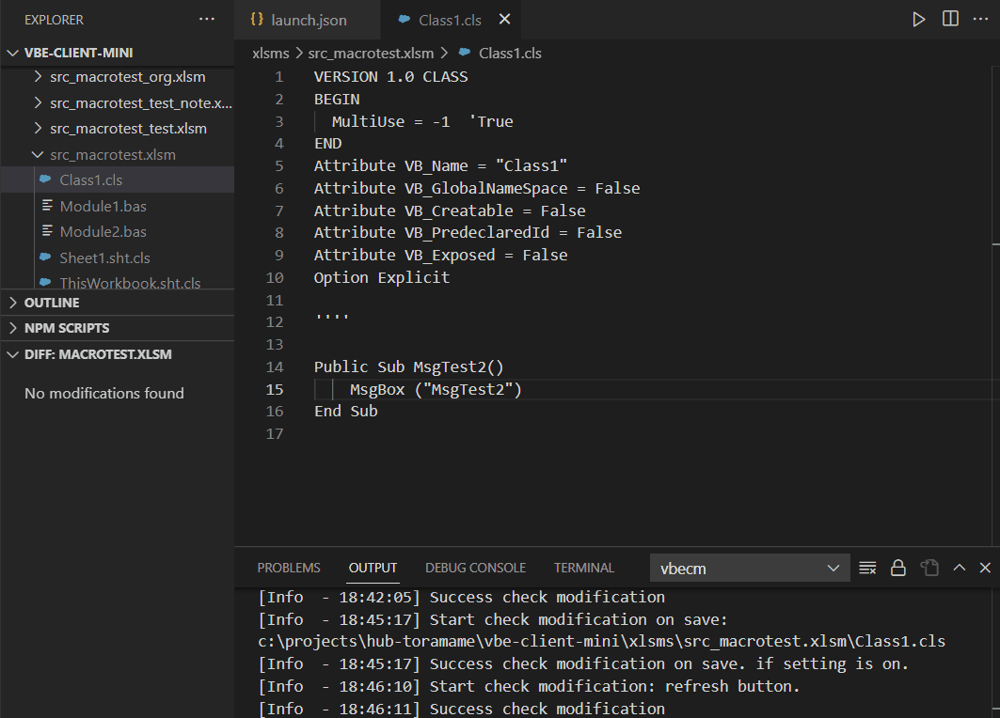

# vbecm README

vbe-client-mini

これはvbeクライアントミニです。
Vba モジュールのエクスポート、vs コードのインポート拡張。
この拡張機能は、Excel を Excel Server と見なします。

[English](./README.md)



## 要件


* ウィンドウズ10
* エクセル

## ご使用前に


### マクロの設定


次の設定をOnにします。

* マクロの設定
    * VBAマクロを有効にする（推奨しません。危険なコードが実行される危険性があります）
* 開発者向けのマクロ設定
    * VBAプロジェクトオブジェクトモデルへのアクセスを信頼する

### vscode 設定ファイル.insertFinalNewline


files.insertFinalNewline を On に設定することをお勧めします。
vbe がモジュールをインポートすると、モジュールは改行ではなくエクスポートされます。
モジュールに改行が追加されます。したがって、vbecm は、エクスポートされたものからインポートされたものとの違いを検出します。

### vscodeエンコーディング


ロケールの vbe エンコーディングが utf-8 に変換できない場合は、
vbaモジュールのvscodeエンコーディングを適切に設定します。自動検出を使用しないでください。
日本語の場合、自動検出を設定すると、検出エラーが発生する場合があります。

### 除外設定


エクスプローラーと検索で .base および .vbe フォルダーを除外することをお勧めします。

```

"files.exclude": {
"**/.base": true,
"**/.vbe": true,
"**/.frx": true
},
"search.exclude": {
"**/.base": true,
"**/.vbe": true,
},

```
### 設定


* Vbecm: Auto Refresh Diff
    * オンに設定すると、差分ツリー ビューが自動的に更新されます

* Vbecm: Vbs Encode
    * cjk 言語エリアで、vbs メッセージが日本語以外でうまく動作しません。エンコード オプションの設定
        vbecm.vbsEncode、日本語の「windows-31j」用

* Vbecm: Diff Exclude
    * vba 以外のフォルダーがある場合は、差分ツリー ビューで検出されます。
        除外するフォルダーを設定します。

* Vbecm: Open Encoding Test
    * 日本人向け。 vscode が非 sjis エンコーディングのファイルを開くと、メッセージが表示されます。
        ミスが多い場合は発進してください。

### おすすめ


必要に応じて、以下の VSCode VBA をインストールすることをお勧めします。
* https://marketplace.visualstudio.com/items?itemName=spences10.VBA

## 特徴


この拡張機能を使用する前に、xlsm または xlam ファイルをバックアップする必要があります。

### xlsm および xlam のエクスプローラー コンテキスト メニュー


* すべての VBA モジュールをエクスポートする
    * vba モジュールを xlsm ファイルからフォルダーにエクスポートします。
    * エクスプローラーで xlsm ファイルを選択し、右クリックして [エクスポート] を選択します。
        同じフォルダーに Src_[xxx.xlsm] フォルダーがあります。
* すべての VBA モジュールをインポートする
    * vba モジュールを xlsm ファイルにインポートします。
    * src_file.xlsm フォルダーからモジュールをインポートできます。
* VBAをコンパイルする
    * コンパイルしてください。
    * vbecm はコンパイルの完了を検出できないため、VBE で確認してください。
* frx モジュールのみをエクスポートする
    * frx モジュールのエクスポート
    * frx が変更されているかどうかはわかりません。 vscode の frm を変更した場合、
        frx ファイルのみをエクスポートできます。

### Src_[xxx.xlsm] フォルダーのエクスプローラー コンテキスト メニュー


* すべての Vba モジュールをプッシュ
    * すべてのモジュールを Src_[xxx.xlsm] フォルダーからプッシュする
    * ソース フォルダー内のすべてのモジュールを Excel ブックにプッシュできます。
* すべての Vba モジュールをプル
    * すべてのモジュールを Src_[xxx.xlsm] フォルダーにプルします。
* 変更されたチェック
    * srcXXX、.vbe、.base の変更を確認します。
    * 結果はExplore Diffに表示されます
* プロジェクトのコンパイル
    * 選択したフォルダー プロジェクトをコンパイルします。

### DIFF の Explorer コンテキスト メニュー:


変更されたモジュールは DIFF に表示されます。

#### src(ベース)


src フォルダーに何らかの変更がある場合、変更されたモジュールが表示されます。
Vbecm は、src とベース フォルダー間の変更をチェックします。

クリックして、base のモジュールと src のモジュールを比較できます。

右クリックして、モジュールを Excel にプッシュできます。

#### vbe(ベース)


VBE に変更がある場合は、変更されたモジュールが表示されます。
Vbecm は、src フォルダーと vbe フォルダーの間の変更をチェックします。

クリックして、base のモジュールと vbe のモジュールを比較できます。

解決コマンドは新しいバージョンでは、削除しました。

#### 競合


Vbcmeは、VBEとSrcで競合を検知した場合は、confliction  treeが有効になります。
競合個所を修正してから、コミットしてください。

### エディターのコンテキスト メニュー


* VBA モジュールのプッシュ
    * vba モジュールをエディターの xlsm ファイルにプッシュします。
    * 選択したモジュールが xlsm ファイルにインポートされます。
* サブ関数を実行
    * エディターで Sub() 関数を実行します。
    * サブ XXX() 行を選択し、右クリックして実行を選択します。
* VBA モジュールのプル
    * 選択したモジュール フォーム xlsm ファイルをプルします。
    * モジュールを変更した場合、vbe は src 内のモジュールを vbe で上書きします。
* Vbe モジュールに移動
    * 選択したエディターから vbe フォームのモジュールのコードに移動します。
        ワークブック モジュールでは機能しません。

### フォルダ


#### src_[excelBookName] フォルダー


モジュールをエクスポートすると、モジュールは src_[excelBookName] フォルダーにあります。

#### .base フォルダー


src_[excelBookName] フォルダーに、.base フォルダーが表示されます。
モジュールをコミットまたはインポートすると、このフォルダーが更新されます。
また、モジュールをエクスポートすると、vbecm は src_[excelBookName] フォルダーと .base フォルダーに違いがあるかどうかをテストします。

#### .vbe フォルダー


src_[excelBookName] フォルダーに、.vbe フォルダーが表示されます。
モジュールをコミットまたはインポートするか、変更をチェックすると、このフォルダーが更新されます。
また、モジュールをインポートすると、vbecm は .vbe フォルダーと .base フォルダーに違いがあるかどうかをテストします。

## 構築方法


https://code.visualstudio.com/api/working-with-extensions/publishing-extension

```

npm install -g vsce
vsce パッケージ --ターゲット win32-x64
vsce パブリッシュ

```

## 既知の問題


* 場合によっては、Excel がバックグラウンドのままになることがあります。タスクマネージャーでプロセスを強制終了する必要があります。ごめん。
* 場合によっては、エクスポートまたはインポート エラーが発生することがあります。したがって、バックアップの Excel ブックから回復します。
* vbecm が動作している場合、ステータスバーに [[vbecm]] が表示されます。
    [[vbecm]] なしで vbecm メニューが表示されない場合は、おそらくバグです。vscode をリロードしてください。
* シート モジュールをインポートすると、モジュールの最後に新しい空の行が見つかることがあります。
* フォルダ src_GUID が表示される場合があります。何らかのエラーが発生した場合に残ります。削除してください。

## 浅潜り


ディープダイブではありません。

### シート モジュールとワークブック モジュール


シート モジュールとワークブック モジュールは、[ModuleName].sht.cls にエクスポートされます。
vbecm では、通常のクラス モジュールとシート (ブック) モジュールを区別します。
[VbaDeveloper](https://github.com/hilkoc/vbaDeveloper "VbaDeveloper") をありがとう

### 開いたエクセルファイル


vbecm が動作している間、Excel は終了しません。エクセルの使用を終了するときは、終了してください。

### xlamファイルの場合


xlam ファイルを使用する場合は、vbecm でブックを Excel インスタンスに追加します。

### インポート元


frm モジュールをインポートすると、余分な行が追加されます。
vbecm は行を削除します。

### 差分アルゴリズム

私たちは dir-compare を使用しており、それを使用できることに非常に感謝しています。
https://github.com/gliviu/dir-compare
そして、オプション IGNORE CONTENT CASE が必要なため、フォークしていくつかの変更を追加します。
おそらく、フォークせずに簡単に拡張する方法があると思います。

## リリースノート


[see change log](./CHANGELOG.md)

